***Problem Identification and Statement***

*The objective is to develop a software that can process a text file and produce a concordance: an alphabetic listing of the words in the file and the frequency of each word. Punctuation and other non- alphabetic symbols (including numbers) should be ignored. The concordance (list of unique words along with their frequency of occurrence in the file) must be stored to an output file and displayed on the output screen*

***Gathering  of  Information  and  Input/Output Description***

**Relevant information:**  

*A task often performed in information retrieval is the determination of the "most important concepts" of a text document. You experience the results of this task when you do a Web search – a search engine analyses Web pages to determine whether their content agrees with your search criteria.* 

*A concordance is an alphabetical list of the principal words used in a book or body of work, listing every instance of each word with its immediate context (). The concordance of a file is thus an alphabetic listing of the words in the file and the frequency of each word.*  

*Concordance programs have been used in literary and mostly religious text analysis for decades. They aim to count and define the frequency and function of a word or word groups in a given text. The aim is to give an inductive understanding of the word/structure and its use in authentic texts (Yavuz).* 

*All words in the text file need to be tokenized because logically a concordance does not contain non- alphabetical characters. Since punctuation and all non-alphabetic characters are to be ignored, all words containing the same are split to form their own words. This process is called tokenizing of a string. For tokenization, we can keep reading characters from the input text file and append it to a word until a non-alphabetic character is encountered. When a non-alphabetic character is encountered, the word formed up till that point becomes one token and is sent for further evaluation. This way, the non-alphabetic character is not considered and hence removed from the concordance evaluation. This process is repeated till all characters from the file are read. Not only does this tokenize the words of the input text file, it also removes all non-alphabetical characters.*  

*After that, to check the frequency of each word, each word that is formed is to be compared with all the words that were formed before it. In case a match is found, the frequency is incremented by 1. In case a match is not found, the word is added to the concordance database and its frequency is set to 1. Thereafter, the words database is to be sorted in alphabetical order with its corresponding frequencies. This can be done by comparing two consecutive words in the database. If the first word is lexicographically bigger than the second one, the two are to be swapped and their corresponding frequencies are also supposed to be swapped. This will keep pushing the largest words towards the end of the database such that at the end of the iteration, the database is sorted alphabetically. Ultimately, the entire concordance data is outputted to another text file and is displayed on the output screen.* 

**Input/Output Description:** 

*The inputs are: Input Text File*

*The outputs are:*  

1. *Concordance Text File*  
2. *Concordance data on the output screen (i.e., alphabetic listing of unique words in the input text file and their corresponding frequencies)* 

*Technically, the input text file can be any kind of text file since the software is equipped to deal with all kinds of characters. For logical reasons, the input text file is mostly a file containing text that needs to be evaluated for intelligent information retrieval.*  

*One output of the software is in the format of a text file and the second output is displayed on the output console of the C++ platform being used.*

**Black-box Diagram:** 

Alternatively, the inputs and outputs could be represented using a black-box diagram:

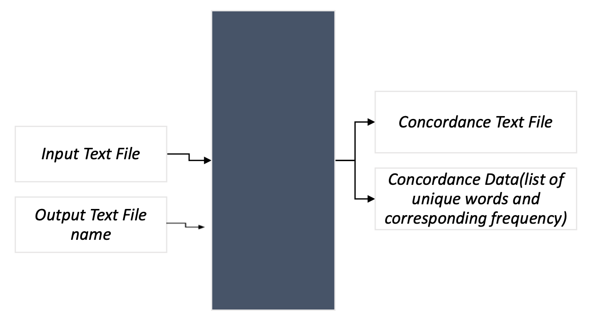

***Hand-solved problems***

Note: An online concordance generator [(https://www.lextutor.ca/conc/text/)](https://www.lextutor.ca/conc/text/) has been used to find the concordance of the given input texts for step 3. However, the generator considers numbers  while  processing  the  text  and  ignores  tokens  that  are  not  part  of  the  English dictionary.  In  our  software,  we  ignore  numbers  and  we  consider  all  alphabetic  tokens, whether or not it is found in the English dictionary. Hence, the expected outcome can be different from what is seen. However, the differences expected have been described for each test case. Moreover, our output will entirely be in lower-case.  

**Test case 1: Valid File** 

**Input:**  

*Input text file name: “paragraph.txt”* 

  As Michael Harvey writes, paragraphs are “in essence—a form of punctuation, and like other forms of punctuation they are meant to make written material easy to read[.”**\[1\]** ](https://courses.lumenlearning.com/waymaker-level3-english/chapter/text-the-perfect-paragraph/#footnote-542-1)Effective paragraphs are the fundamental units of academic writing; consequently, the thoughtful, multifaceted arguments that your professors expect depend on them. Without good paragraphs, you simply cannot clearly convey sequential points and their relationships to one another.  
  
  Many novice writers tend to make a sharp distinction between content and style, thinking that a paper can be strong in one and weak in the other, but focusing on organization shows how content and style converge in deliberative academic writing. Your professors will view even the most elegant prose as rambling and tedious if there isn’t a careful, coherent argument to give the text meaning. Paragraphs are the “stuff ” of academic writing and, thus, worth our attention here. 

*Output text file name: “concord.txt”* 

**Expected Outcome:**  

Data stored in concordance file! 

Concordance of file: 

The key differences between the above output and the software output are: 

- The software should ignore numbers (as opposed to the above-given generator which considers “1” to be one of its tokens) 
- The software should split the contraction “isn’t” into two tokens: “isn” and “t” (the online generator splits the “isn’t” into “is” and “not”) 
- Hence, the software should display 100 unique words 
- The program must print a confirmation message on the output screen once the data is stored in the file. 

**Test case 2: Valid File** 

**Input:** 
*Input text file name: “drivers.txt”* 

Driving\_&\_Cell\_Phones 

Canadian drivers' concern over cellphone use in vehicles has grown to the point where a majority of them would support a ban on hand-held phones while driving. The finding comes from the Road Safety Monitor, which is an annual public opinion survey done  by  the  Traffic  Injury  Research  Foundation  (TIRF).  About  64  per  cent  of respondents said the use of cellphones by drivers is a serious problem, while 68 per cent said they would support a ban. 'Canadians definitely support tougher measures to control aggressive and distracted driving,' TIRF president and CEO Herb Simpson said. 'They are concerned about risky driving behaviours, and they want something done about it.' The Newfoundland government introduced a bill in April that could lead to the first provincial ban on cellphone use while driving, although a number of other Canadian provinces are considering similar legislation. England, Italy and Japan are among countries that have imposed cellphone bans. The state of New York and 14 other  local  jurisdictions  throughout  the  U.S.  have  also  enacted  prohibitions.  The report found that aggressive driving behaviour, such as speeding, running red lights and tailgating, are observed much more frequently than courteous driving behaviour such as waiting for pedestrians to cross or allowing drivers to merge. Two-thirds of respondents said they want tougher rules of the road to deal with overly aggressive drivers. 'We know that reducing the overall risk of traffic-crash involvement depends on our ability to reduce the extent to which drivers engage in unsafe, illegal and/or risky driving behaviours,' Mr. Simpson said. More than half of those polled admitted to 'swearing under their breath' while driving, while 12 per cent said they like taking risks while driving just for the fun of it.' The primary sponsors of the Road Safety Monitor are Transport Canada and the Brewers Association of Canada. More than 1,200 drivers were surveyed by telephone in April on a number of road-safety issues. Established in 1964 and based in Ottawa, the TIRF works to reduce traffic-related deaths and injuries. TIRF designs, promotes and implements research-based programs and policies. 

*Output text file name: “driversconcord.txt”* 

**Expected Outcome:**  

Data stored in concordance file! 

Concordance of file: 

The key differences between the above output and the software output are:

- The software should ignore numbers (the generator displays 6 numbers) 
- The software should display “u” and “s” as 2 additional tokens after tokenizing “U.S” (the generator reads it as one phrase: “US”) 
- Hence, the software should display 192 unique words  
- The program must print a confirmation message on the output screen once the data is stored in the file. 

**Test case 3: Valid File** 

**Input:** 

*Input text file name: “technology.txt”* 

Technology is the most useful form of science for the general population. In simple words, technology is when we take the concepts of science and transform them into gadgets and devices that are useful to us as human beings. When we look around us, almost everything is a result of or a form of technology. 

For example, the device you are using right now is a form of technology made for communication, or the refrigerator in your kitchen is a use of science that helps to keep your food fresh and cool. With these examples, we see how dependent we are on technology and how important it is for us in our daily lives. 

It isn’t easy to imagine our lives without using any form of technology. For the smallest of communications, we tend to turn to our mobile phones. Even most of the food we eat is packaged in factories using various technologies. Thus, imagining a life without technology is impossible. It is not only a fact of life but also a necessity for all of us.

*Output text file name: “tech.txt”* 

**Expected Outcome:**  

Data stored in concordance file! 

Concordance of file: 

 

The key differences between the above output and the software output are:

- The software should split the contraction “isn’t” into two tokens: “isn” and “t” (the online generator splits the “isn’t” into “is” and “not”) adding 2 words to the list of unique words (since “is” and “not” are already part of the text file as well) 
- Hence, the software should display 96 unique words  
- The program must print a confirmation message on the output screen once the data is stored in the file. 

**Test case 4: Invalid file name**

**Input:**  

*Input file name: “filedoesnotexist.txt”*  

**Expected Outcome:** Error opening file** 

**Test case 5: Empty text file**

**Input:**  

*Input file name: “empty.txt”* 

*Output text file name: “emptyconcord.txt”* 

**Expected Outcome:** 

Data stored in Concordance file! Concordance of a file:

**Test case 6: Only Punctuation text file**

**Input:**  

*Input file name: “onlypunctuation.txt”  Output text file name: “opconcord.txt”* 

**Expected Outcome:** 

Data stored in Concordance file! Concordance of a file:
  
   

**Software testing and Verification** 

**Test Case 1:**  

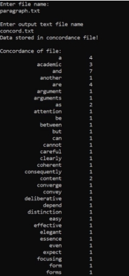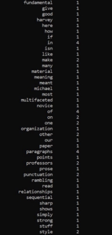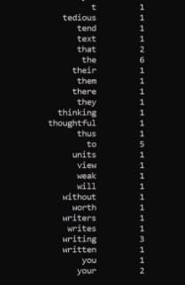

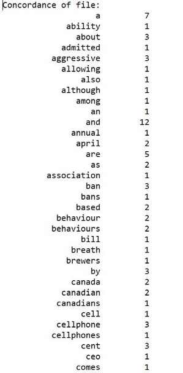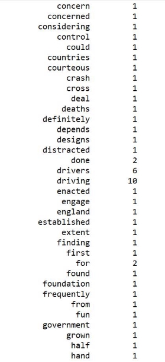

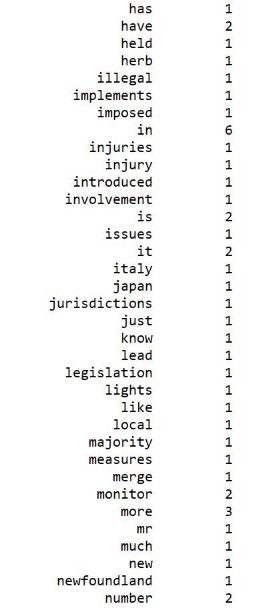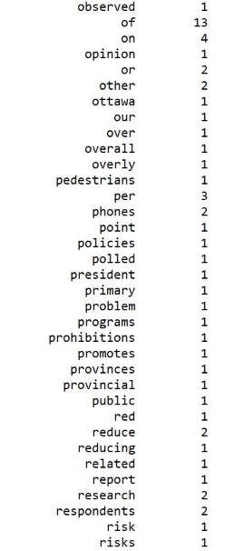

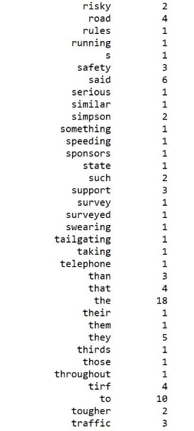

which is in agreement with the test case expected output. 

**Test Case 2:** 

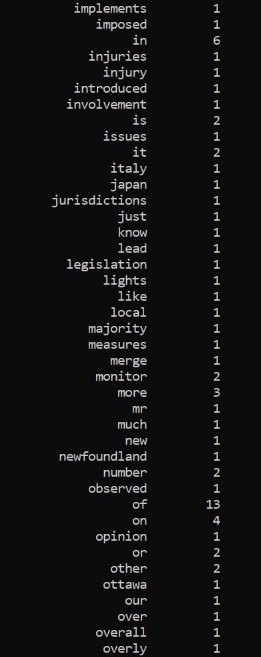

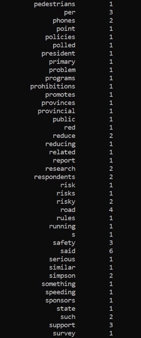 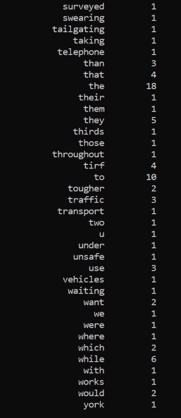

which is in agreement with the test case expected output.

**Test Case 3:**  

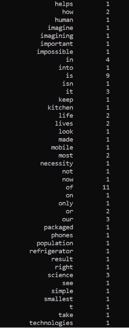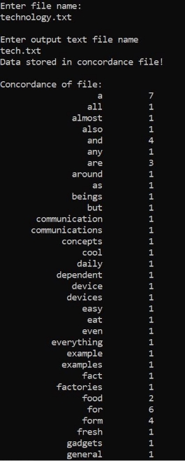

which is in agreement with the test case expected output.

**Test Case 4:**  

which is in agreement with the test case expected output.

**Test Case 5:** 

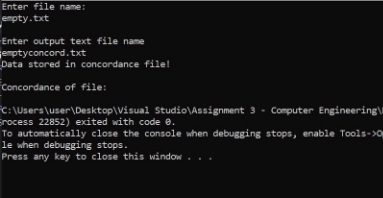 

which is in agreement with the test case expected output.

**Test Case 6:**  

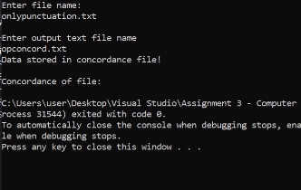

which is in agreement with the test case expected output.

**User Guide:** 

- To execute the program, create any text file with text and save it in the same folder as your .cpp file 
- Compile and run the code found in the file named Assignment 3 - Computer Engineering.cpp 
- You will be prompted to enter the name of the text file you created 
- You will then be prompted to enter the name of a data file to which the concordance data will be outputted 

**Reference:** 

“Concordance (Publishing).” *Wikipedia*, Wikimedia Foundation, 6 May 2021, 

en.wikipedia.org/wiki/Concordance\_(publishing).  

Yavuz, Fatih. “The Use of Concordancing Programs in ELT.” *Procedia - Social and Behavioral* 

*Sciences*, vol. 116, 21 Feb. 2014, pp. 2312–2315., doi:10.1016/j.sbspro.2014.01.565.  
